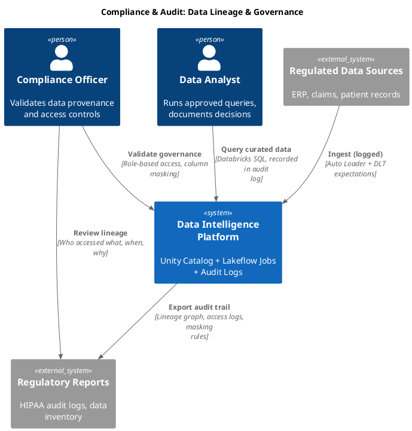
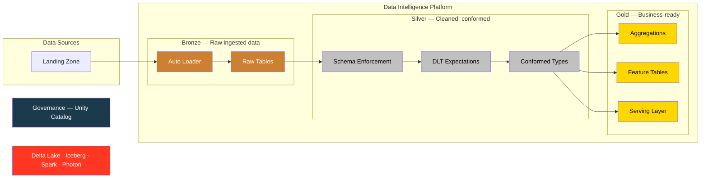
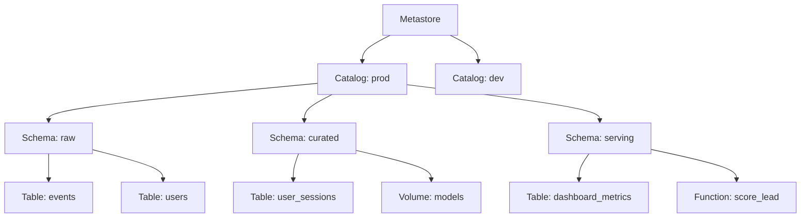
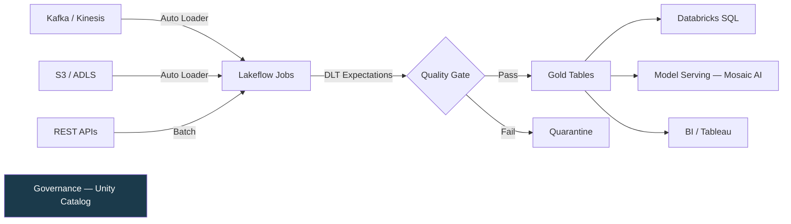
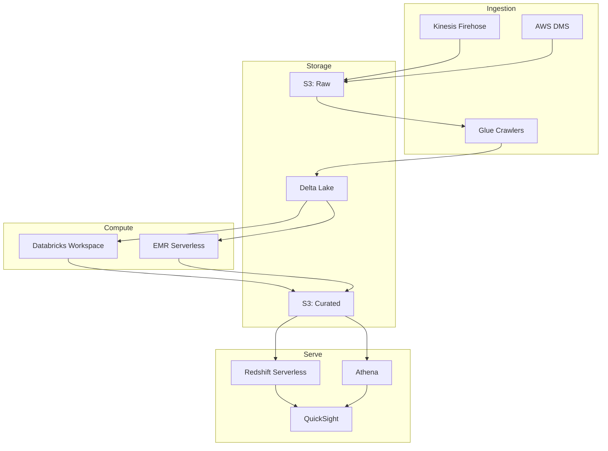
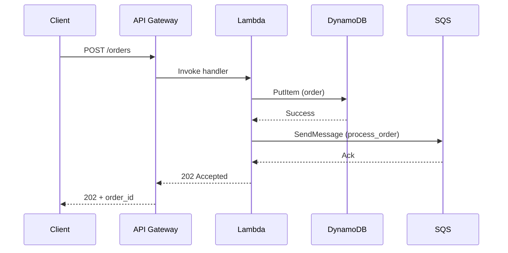
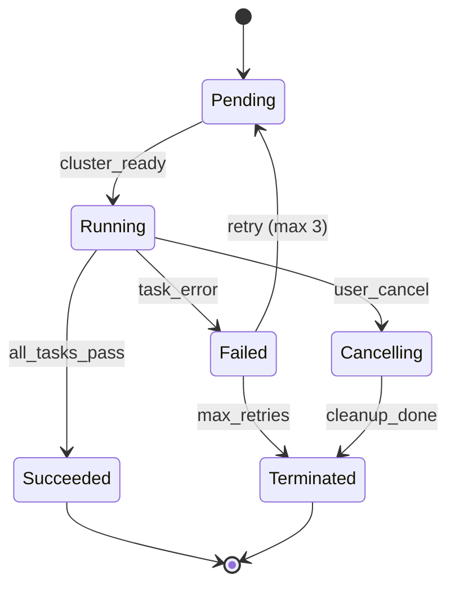
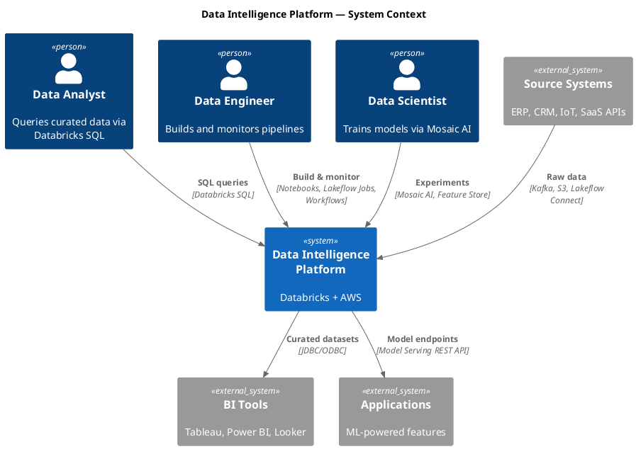
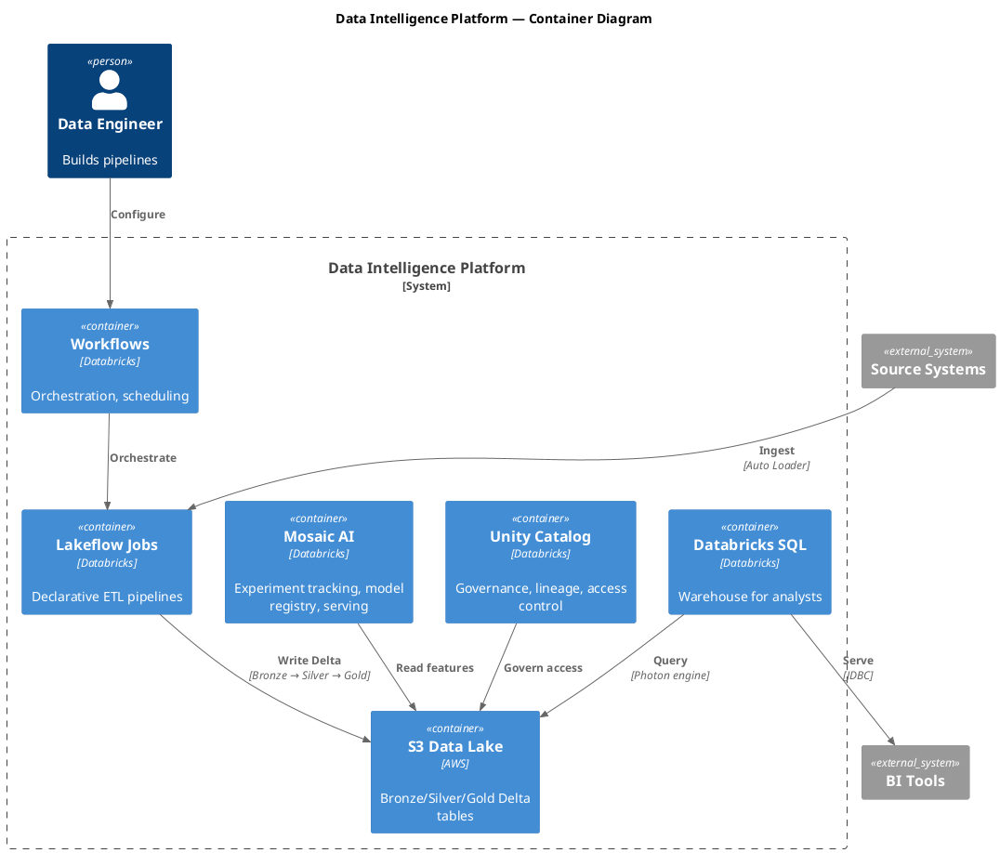

# Diagram

Generate technical architecture diagrams using multiple formats. Built for solutions architects working with Databricks, AWS, and data platforms.

**v3.2 note:** Databricks-facing diagrams now follow the official reference architecture visual language. See "Databricks Visual Standards" section below.

## Tool Selection

```
Auto-layout OK (linear flows, sequences, ERDs)?            → uml-mcp (D2, Mermaid, PlantUML)
Positioned layout required (reference architectures,        → Excalidraw
  multi-zone diagrams, Databricks layout spine)?
C4 architecture (Context/Container/Component)?              → uml-mcp (PlantUML C4)
Needs to render in GitHub markdown?                         → uml-mcp (Mermaid)
Graph/network topology?                                     → uml-mcp (Graphviz)
Entity-relationship / data model?                           → uml-mcp (ERD)
Business process / workflow?                                → uml-mcp (BPMN)
Quick preview with live reload?                             → mermaid server (fallback)
Interactive, clickable nodes / tooltips?                    → See interactive-diagrams skill
```

**Default to uml-mcp** for auto-layout diagrams — it covers the most formats via Kroki. **Default to Excalidraw** for reference architectures with spanning bars or deliberate zone positioning. Use the dedicated `mermaid` server only when you need live browser reload during iteration. For interactive, clickable diagrams, cross-reference the **interactive-diagrams** skill.

### Auto-Layout vs Positioned Layout

This is the most important format decision. Get it wrong and the diagram looks like a dependency graph instead of an architecture.

**Use auto-layout (D2, Mermaid, PlantUML)** when:
- The diagram is a linear flow (A → B → C → D)
- Sequence diagrams (message arrows between participants)
- ERDs and class diagrams (node-link with no spatial meaning)
- Simple flowcharts with <15 nodes and no spanning elements
- The spatial position of nodes doesn't carry meaning

**Use positioned layout (Excalidraw)** when:
- The diagram has horizontal spanning bars (governance, orchestration, foundation)
- Zones must be deliberately placed (sources left, consumers right, platform center)
- The Databricks layout spine is required (any customer-facing reference architecture)
- The diagram has >15 nodes across 4+ logical zones
- Color fills, branded elements, or zone backgrounds need precise control
- You need it to look like an official Databricks reference architecture

**The test:** If the diagram has ANY full-width horizontal bar (governance, foundation, orchestration), it CANNOT use auto-layout. Auto-layout engines treat bars as regular nodes and scatter them. Use Excalidraw.

## MCP Tools Available

**uml-mcp** (`uml-mcp` server — primary, covers 16 diagram types):
- `generate_uml` — render diagram to file (SVG/PNG/PDF)
  - `diagram_type`: class, sequence, activity, usecase, state, component, deployment, object, mermaid, d2, graphviz, tikz, erd, blockdiag, bpmn, c4
  - `code`: diagram source code in the chosen format
  - `output_format`: svg (default), png, pdf
  - `output_dir`: where to save (optional)
  - `theme`, `scale`: styling options
- `generate_diagram_url` — returns URL + base64 (no file saved)

**Mermaid** (`mermaid` server — fallback, live reload):
- `mermaid_preview` — render + live preview in browser
- `mermaid_save` — export to SVG/PNG/PDF

**Excalidraw** (`excalidraw` server — requires canvas on localhost:3000):
- `create_element`, `batch_create_elements` — draw shapes, arrows, text
- `export_to_image`, `export_scene` — export to PNG/SVG/JSON
- `create_from_mermaid` — convert Mermaid to Excalidraw
- `describe_scene`, `get_canvas_screenshot` — visual feedback loop

## Format Selection Guide

| Use case | Best format | Why |
|---|---|---|
| System context / containers / components | **PlantUML C4** | Purpose-built for C4 model, best tooling |
| Complex architecture with clean layout | **D2** | Multiple layout engines, sketch mode, modern |
| GitHub PR / README embedding | **Mermaid** | Native GitHub rendering |
| Network/infra topology | **Graphviz** | Best automatic layout for graphs |
| Database schema | **ERD** | Purpose-built for entity relationships |
| Business process flows | **BPMN** | Industry standard |
| Quick iteration with live preview | **Mermaid** (via mermaid server) | Live browser reload |
| Customer-facing slides | **Excalidraw** | Hand-drawn aesthetic |
| Databricks reference architecture (multi-zone, branded) | **Excalidraw** | Only tool that supports positioned layout with zone control |
| Clickable, interactive, zooming | **D3.js / Cytoscape** | See interactive-diagrams skill |

---

## Databricks Visual Standards

Extracted from official Databricks reference architectures (Data Intelligence Platform, Healthcare Patient Personalization, DASF). **Use these conventions for any Databricks-facing diagram** — customer presentations, GTM materials, internal architecture reviews.

### Layout Spine

Every Databricks reference architecture follows the same horizontal structure:

```
┌──────────┐   ┌──────────────┐   ┌────────────────────────────┐   ┌───────────┐   ┌──────────┐
│  Data     │ → │ Connectivity │ → │   Data Intelligence        │ → │ Serving / │ → │ Consumer │
│  Sources  │   │ / Ingestion  │   │   Platform (center)        │   │ BI / Apps │   │ Systems  │
└──────────┘   └──────────────┘   └────────────────────────────┘   └───────────┘   └──────────┘
                                   Governance bar (bottom or top, full width)
                                   Foundation bar (bottom, logos: Delta Lake, Iceberg, Spark, Photon, Unity Catalog)
```

**Rules:**
- Primary flow is LEFT TO RIGHT. Always. No exceptions for Databricks diagrams.
- Data sources on the far left as a vertical stack with icons.
- Consumers/applications on the far right as a vertical stack with icons.
- The Databricks platform occupies the center as a large bounded region.
- The platform banner ("Data Intelligence Platform") spans the full width of the center section at the top, in coral/salmon.

**Format implication:** The Databricks layout spine with its horizontal spanning bars (platform banner, orchestration, governance, foundation) REQUIRES positioned layout. D2 and Mermaid auto-layout engines will scatter these bars as regular nodes, destroying the visual hierarchy. Use Excalidraw for any diagram that follows this spine.

**Lifecycle exception:** Iterative or lifecycle processes (e.g., AI Agent Systems, MLOps loops) use a CIRCULAR layout instead of left-to-right linear flow. The Databricks AI Agent lifecycle shows: Prepare data → Build agents → Evaluate agents → Deploy agents → Govern agents in a cycle. When a lifecycle process appears within a linear diagram, it occupies its own zone with a circular internal layout while the surrounding data flow remains left-to-right.

### Color Palette (Databricks Official)

These colors are extracted from the reference architectures. Use them consistently.

```
STRUCTURAL COLORS (framing, not content):
  Coral/Salmon banner:    #FF3621   — "Data Intelligence Platform" top bar, foundation bar accent
  Dark teal/navy:         #1B3A4B   — Orchestration bar, Governance bar, section headers
  White:                  #FFFFFF   — Main content background, node fills
  Light gray:             #F5F5F5   — Subtle zone backgrounds

FUNCTIONAL COLORS (content nodes):
  Databricks blue:        #137CBD   — Primary functional blocks (Data Prep, Raw Data, Serving Infrastructure)
  Teal accent:            #00A972   — Numbered step indicators (circled numbers for guided flow)
  Gold/amber accent:      #FFC107   — Operational concerns (Monitor, Operations, alerts)
  Rose/mauve:             #9B2D5E   — ML/AI zones (Develop and Evaluate Model, Mosaic AI)
  
MEDALLION LAYERS:
  Bronze:                 #CD7F32   — with white text, label format: "Bronze — {description of contents}"
  Silver:                 #C0C0C0   — with dark text, label format: "Silver — {description of contents}"
  Gold:                   #FFD700   — with dark text, label format: "Gold — {description of contents}"

DO NOT USE:
  Random rainbow colors
  Bright red for non-error content
  Purple for generic nodes (reserve for ML/AI zones only)
```

### Border Conventions

Databricks reference architectures use two distinct border styles with specific meanings:

- **Solid borders** — External systems (data sources, consumers) and the platform boundary itself. The platform boundary uses a coral/salmon solid stroke (#FF3621).
- **Dashed borders** — Functional zones WITHIN the platform. ETL zone, Process zone, Predict zone, AI Agent Systems zone. These indicate logical groupings inside the platform, not hard system boundaries.

Never mix these — a dashed border on an external system or a solid border on an internal zone violates the visual grammar.

In D2:
```d2
# External system — solid border
sources: Data Sources {
  style.stroke: "#333"
  style.stroke-dash: 0
}

# Internal zone — dashed border
etl_zone: ETL {
  style.stroke: "#666"
  style.stroke-dash: 5
}

# Platform boundary — solid coral
platform: Data Intelligence Platform {
  style.stroke: "#FF3621"
  style.stroke-width: 2
}
```

### Icon Conventions

Two distinct icon styles appear in every reference architecture:

- **Teal filled circles** (#00A972) — Numbered step indicators. These guide the reader through the diagram: ①②③... They are navigation aids, not content.
- **Orange/amber outline circles** (stroke: #E8842C, no fill) — Databricks-native abstract concepts. Used for medallion layer icons, ingestion type icons (batch, CDC, streaming), and feature icons within functional zones. These are NOT filled — they're line-art with an orange circular border.

The distinction matters: teal circles tell you WHERE you are in the flow. Orange circles tell you WHAT a Databricks component does.

In Mermaid, approximate with classDef:
```mermaid
classDef step_indicator fill:#00A972,color:#fff,stroke:#00A972
classDef dbx_icon fill:#fff,stroke:#E8842C,stroke-width:2px,color:#333
```

### Governance Positioning

**Governance is NEVER a side-node or a box among other boxes.** In every Databricks reference architecture, governance is structural — a full-width horizontal bar.

Two valid placements:
1. **Foundation layer** (most common): A dark teal bar at the bottom spanning the full platform width. Contains "Governance" label and "Unity Catalog" logo/text. Everything above it sits ON the governance layer.
2. **Overarching header**: "Governance" as a header above the entire platform, with a line connecting down to all governed zones.

```d2
# CORRECT: Governance as foundation bar
governance: Governance — Unity Catalog {
  style.fill: "#1B3A4B"
  style.font-color: "#fff"
  style.border-radius: 0
}

# WRONG: Governance as a node among other nodes
platform {
  bronze: Bronze
  silver: Silver
  gold: Gold
  uc: Unity Catalog    # ← NO. This makes UC look like a peer of Bronze/Silver/Gold
}
```

### Numbered Flow Steps

Databricks reference architectures use circled numbers to create a guided reading path. This is critical for customer presentations — it tells the viewer where to start and what order to follow.

```
(1) Data Sources → (2) Connectivity/Ingestion → (3) Lakehouse layers → 
(4) Processing (Data Engineering, AI/ML) → (5) Query/SQL → 
(6) Dashboards → (7) Serve → (8) External consumers
```

In diagram code, represent these as labeled nodes or annotations near the relevant section. Not every diagram needs all 8 steps — use as many as the complexity warrants.

### Medallion Layer Labels

**Always include a description with each medallion layer.** The tier name alone is not enough. Show what's IN each layer for this specific use case.

```
GOOD:
  Bronze — Raw files (encounter notes, images, documents)
  Silver — Quality-checked patient, claims, provider and pharmacy data
  Gold — Patient profile, HEDIS, provider hub, care plan, clinical events

BAD:
  Bronze (Raw)
  Silver (Cleaned)
  Gold (Analytics)
```

The description makes the diagram self-documenting — a viewer understands what each layer contains without needing a separate explanation.

### Foundation Technology Bar

At the very bottom of Databricks platform diagrams, include a foundation bar showing the underlying technology stack. This is a branded element that reinforces the open-source story.

Standard contents: **Delta Lake**, **Iceberg**, **Apache Spark**, **Photon**, **Unity Catalog**

In D2:
```d2
foundation: "" {
  style.fill: "#FF3621"
  style.font-color: "#fff"
  delta: Delta Lake
  iceberg: Iceberg
  spark: Apache Spark
  photon: Photon
  uc: Unity Catalog
}
```

### Cloud Platform Foundation Layer (cloud-specific diagrams)

For diagrams targeting a specific cloud (Azure, AWS, GCP), add a FOURTH horizontal bar below the Databricks foundation. This shows the underlying cloud services the platform runs on.

Layer stack (top to bottom):
1. Platform banner (coral): "Data Intelligence Platform"
2. Governance bar (dark teal): Unity Catalog
3. Lakehouse foundation: Delta Lake, Iceberg, Spark, Photon
4. Cloud platform bar (cloud-brand color): cloud-specific services

For Azure:
```
Platform (gray): Microsoft Azure | Entra ID | Cost Management | Azure Monitor | Vault Key | DevOps/GitHub | Defender for Cloud
```

For AWS:
```
Platform (orange): AWS | IAM | CloudWatch | KMS | Cost Explorer | CodePipeline | GuardDuty
```

Only include this layer when the audience cares about the cloud infrastructure (enterprise architects, platform teams, security reviews). Skip it for business/executive audiences.

### Product Naming

Use official Databricks product names in diagrams, not generic terms:

| Generic (don't use) | Databricks name (use this) |
|---|---|
| Data catalog | Unity Catalog |
| ETL pipelines | Lakeflow Jobs / Delta Live Tables |
| Data warehouse | Databricks SQL |
| ML platform | Mosaic AI |
| Data ingestion | Auto Loader / Lakeflow Connect |
| Feature store | Feature Store (within Unity Catalog) |
| Model serving | Model Serving (within Mosaic AI) |
| Natural language query | AI/BI Genie |
| Data quality | DLT Expectations / Lakehouse Monitoring |
| Marketplace | Databricks Marketplace |
| Data pipeline orchestration | Lakeflow Jobs |
| Database replication / CDC | Lakeflow Connect |
| AI agents | AI Agent Systems (with lifecycle: prepare → build → evaluate → deploy → govern) |
| Natural language BI | AI/BI Genie |
| Data sharing | Delta Sharing |
| Declarative ETL | Lakeflow Spark Declarative Pipelines |

---

## Workflow: Diagram Creation

```
STEP 0: Confirm Audience & Intent
  Q: Who reads this? (executive, architect, engineer, compliance officer?)
  Q: Why? (stakeholder alignment, design review, RFC, compliance audit trail?)
  Q: Format? (slides, Confluence doc, GitHub README, printed handout?)
  Q: Is this Databricks-facing? → If yes, apply Databricks Visual Standards above.
  → Diagram STYLE and DEPTH depend on answers

STEP 1: Clarify Scope & Complexity
  Q: How many systems / components?
  Q: Are there loops, dependencies, or conditional flows?
  Q: If >20 nodes: should this be split into C4 levels (Context → Container → Component)?

STEP 2: Choose Format & Tool
  See format selection guide above

STEP 3: Generate & Preview
  Use uml-mcp or mermaid server to render
  Show user or open in browser (mermaid server auto-reloads)

STEP 4: Iterate
  Refine based on feedback (layout, labels, colors, grouping)

STEP 5: Export & Embed
  Save to docs/diagrams/{name}.{svg|png|mmd}
  Embed in markdown with descriptive alt text
  Document source system & date

CRITICAL: Never save a diagram the user hasn't seen.
```

---

## Databricks GTM Use Cases

### Scenario 1: Healthcare Oncology Data Unification

**Audience:** C-suite + medical informatics leads  
**Intent:** Show how Databricks solves fragmented oncology data across regional labs  
**Recommended Format:** D2 (modern, clean, business-friendly)

```d2
direction: right

# ── (1) Data Sources (left stack) ──
sources: Data Sources {
  style.fill: "#F5F5F5"
  lab_a: Regional Lab A\n(Genomics, Pathology, Clinical)
  lab_b: Regional Lab B\n(Genomics, Pathology, Clinical)
  lab_c: Regional Lab C\n(Genomics, Pathology, Clinical)
  ehr: EHR Systems\n(Epic, Cerner)
}

# ── (2) Connectivity ──
connectivity: Connectivity {
  style.fill: "#F5F5F5"
  autoloader: Auto Loader\n(HL7, DICOM, FHIR)
  lakeflow: Lakeflow Connect\n(EHR database extracts)
}

# ── Data Intelligence Platform (center) ──
platform: Data Intelligence Platform {
  style.fill: "#FFFFFF"
  style.stroke: "#FF3621"

  # (3) Lakehouse layers
  bronze: Bronze — Raw HL7 messages, DICOM images, clinical notes {
    style.fill: "#CD7F32"
    style.font-color: "#fff"
  }
  silver: Silver — De-identified, FHIR-normalized patient records {
    style.fill: "#C0C0C0"
  }
  gold: Gold — Patient cohorts, biomarker profiles, trial-ready datasets {
    style.fill: "#FFD700"
  }

  # (4) Processing
  dlt: Lakeflow Jobs {
    style.fill: "#137CBD"
    style.font-color: "#fff"
  }
  mosaic: Mosaic AI\n(Biomarker prediction, cohort scoring) {
    style.fill: "#9B2D5E"
    style.font-color: "#fff"
  }

  # (5) Analytics
  sql: Databricks SQL {
    style.fill: "#137CBD"
    style.font-color: "#fff"
  }
}

# Governance foundation bar
governance: Governance — Unity Catalog (HIPAA, lineage, column-level masking) {
  style.fill: "#1B3A4B"
  style.font-color: "#fff"
}

# Foundation technology bar
foundation: Delta Lake · Iceberg · Apache Spark · Photon {
  style.fill: "#FF3621"
  style.font-color: "#fff"
}

# ── (6) Consumers (right stack) ──
consumers: Consumers {
  style.fill: "#F5F5F5"
  research: Research Oncologists
  trials: Clinical Trial Ops
  rwe: Real-World Evidence Analytics
  bi: Tableau / Power BI
}

# ── Connections (all labeled) ──
sources.lab_a -> connectivity.autoloader: HL7, DICOM
sources.lab_b -> connectivity.autoloader: HL7, DICOM
sources.lab_c -> connectivity.autoloader: HL7, DICOM
sources.ehr -> connectivity.lakeflow: Database CDC

connectivity.autoloader -> platform.bronze: Secure ingest
connectivity.lakeflow -> platform.bronze: Incremental load
platform.bronze -> platform.silver: DLT expectations, de-identification
platform.silver -> platform.gold: Cohort building, aggregation
platform.dlt -> platform.bronze: Orchestrate pipelines
platform.dlt -> platform.silver: Quality enforcement
platform.mosaic -> platform.gold: Biomarker scoring
platform.gold -> platform.sql: Curated datasets

platform.sql -> consumers.research: Ad-hoc queries
platform.sql -> consumers.bi: JDBC/ODBC
platform.mosaic -> consumers.trials: Model Serving API
platform.gold -> consumers.rwe: Export
```

**Talking Points:**
- Unified data from disparate labs — single source of truth
- HIPAA governance built-in via Unity Catalog (lineage, masking, audit)
- Trial-ready datasets reduce time-to-insight from months to days
- Mosaic AI enables predictive biomarker scoring on curated data

---

### Scenario 2: Genomics Data Pipeline for Precision Medicine

**Audience:** Data engineering + research biology team  
**Intent:** Show Lakeflow + Mosaic AI for variant calling, annotation, and model scoring  
**Recommended Format:** PlantUML C4 Container (technical depth)


**Talking Points:**
- End-to-end reproducibility (Mosaic AI + Lakeflow Jobs for audit trail)
- Real-time API for clinical decision support
- Feature Store reduces model deployment latency
- Unity Catalog governs patient data at every step

---

### Scenario 3: Unity Catalog Migration (legacy data lake → governed lakehouse)

**Audience:** Enterprise architects, data governance team  
**Intent:** Show before/after, governance gains, compliance alignment  
**Recommended Format:** D2 with side-by-side comparison

```d2
direction: right

before: Before — Legacy Data Lake {
  style.fill: "#FFE6E6"
  s3: AWS S3 {
    folder_hell: /data/raw/...
    folder_mess: /data/processed/...
    folder_chaos: /data/ml_models/...
  }
  problems: Problems {
    orphaned: Orphaned datasets
    lineage_none: No lineage tracking
    access_wild: Ad-hoc access (S3 bucket policies)
    compliance_gap: Compliance gaps
  }
}

after: After — Databricks Lakehouse + Unity Catalog {
  style.fill: "#E6FFE6"
  uc: Unity Catalog {
    metastore: Metastore
    prod_catalog: Catalog: prod
    dev_catalog: Catalog: dev
  }
  schemas: Schemas (organized) {
    raw: Schema: raw_fhir
    cleaned: Schema: cleaned
    features: Schema: ml_features
  }
  benefits: Benefits {
    lineage: Full lineage tracking
    access: Fine-grained role-based access
    audit: Audit logs, column-level masking
    compliance: HIPAA, GDPR ready
  }
}

migration: Migration Path {
  assess: 1. Assess (data inventory, ownership)
  design: 2. Design (catalog/schema hierarchy)
  migrate: 3. Migrate (external → UC managed tables)
  validate: 4. Validate (lineage, access)
}

before.s3 -> migration.assess: Identify stale / duplicate datasets
migration.assess -> migration.design: Map to UC hierarchy
migration.design -> migration.migrate: Create UC tables via Lakeflow Jobs
migration.migrate -> after.uc: Golden-path ingestion
migration.migrate -> after.schemas: Organize by domain
after.benefits -> after.uc: Governance enabled by default
```

**Talking Points:**
- Phased migration (no big-bang cut-over)
- Lineage + audit trails for compliance officers
- Data quality expectations in Lakeflow Jobs
- Reduced shadow IT (self-service governance)

---

### Scenario 4: Manufacturing Quality Control (IoT → Real-Time Analytics)

**Audience:** Operations + quality teams  
**Intent:** Show real-time defect detection, batch traceability  
**Recommended Format:** Mermaid (GitHub-friendly, simpler for ops teams)

```mermaid
graph LR
    subgraph sources["(1) IoT Sensors — Line 1-10"]
        temp[Temperature]
        pressure[Pressure]
        vibration[Vibration]
        humidity[Humidity]
    end

    subgraph ingestion["(2) Streaming Ingestion"]
        kafka[Kinesis Streams]
        windowed[Tumbling Windows 1min]
    end

    subgraph platform["(3) Data Intelligence Platform"]
        bronze["Bronze — Raw sensor readings, timestamps"]
        silver["Silver — Cleaned, windowed aggregates"]
        gold["Gold — Batch quality scores, SPC metrics"]
        dlt["Lakeflow Jobs"]
        expectations["DLT Expectations"]
    end

    subgraph serving["(4) Real-Time Serving"]
        dashboard["Live Dashboard"]
        sql["Databricks SQL"]
        alerts["Anomaly Detection — Mosaic AI"]
    end

    subgraph consumers["(5) Consumers"]
        ops_team["Operations Team"]
        quality["Quality Manager"]
        compliance_report["Regulatory Reports"]
    end

    governance["Governance — Unity Catalog"]

    sources -->|1,000 msg/sec| kafka
    kafka --> windowed
    windowed -->|Structured streaming| bronze
    dlt -->|Orchestrate| bronze
    bronze -->|DLT expectations| silver
    silver -->|Compute rolling stats| gold
    expectations -->|Reject bad readings| silver
    gold --> sql
    sql --> dashboard
    gold --> alerts
    alerts -->|Halt line if anomaly| ops_team
    dashboard -->|Real-time SPC| quality
    sql -->|Export| compliance_report

    classDef source fill:#F5F5F5,color:#000
    classDef ingest fill:#137CBD,color:#fff
    classDef platform_node fill:#FFFFFF,stroke:#FF3621,color:#000
    classDef serve fill:#137CBD,color:#fff
    classDef consumer fill:#F5F5F5,color:#000
    classDef governance fill:#1B3A4B,color:#fff

    class temp,pressure,vibration,humidity source
    class kafka,windowed ingest
    class bronze,silver,gold,dlt,expectations platform_node
    class dashboard,sql,alerts serve
    class ops_team,quality,compliance_report consumer
    class governance governance
```



**Talking Points:**
- Real-time defect detection (minutes, not hours)
- Full batch traceability for recalls
- Structured streaming for high-frequency data
- Anomaly detection reduces scrap/rework

---

### Scenario 5: Compliance Audit Trail (Data Lineage for Regulators)

**Audience:** Compliance officers, internal audit, external regulators  
**Intent:** Show how Unity Catalog + Lakeflow Jobs provide audit-ready lineage  
**Recommended Format:** PlantUML C4 Context (executive-friendly)



**Talking Points:**
- Every data transformation logged (source → bronze → silver → gold)
- Column-level masking for PII (automatic redaction for analysts)
- Access control tied to job role, not individuals
- Audit logs exportable for regulators (SOX, HIPAA, GDPR)

---

## Architecture Patterns Library

Reference patterns for common solutions architect work. Use these as starting templates — adapt to the user's specific context.

### Medallion Architecture (Databricks Standard)



### Unity Catalog Hierarchy



### Data Pipeline (Lakeflow / Spark Streaming)



### AWS Data Platform



### Sequence: API Request Flow



### State Diagram: Job Lifecycle



### C4 Context: Data Platform (PlantUML)



### C4 Container: Data Platform (PlantUML)



### D2: Lakehouse Architecture (Databricks Standard)

```d2
direction: right

# (1) Data Sources
sources: Data Sources {
  style.fill: "#F5F5F5"
  erp: ERP
  crm: CRM
  iot: IoT Streams
  saas: SaaS APIs
}

# (2) Connectivity
ingestion: Connectivity {
  style.fill: "#F5F5F5"
  autoloader: Auto Loader
  kafka: Kafka Connect
  dms: Lakeflow Connect
}

# Data Intelligence Platform
platform_banner: Data Intelligence Platform {
  style.fill: "#FF3621"
  style.font-color: "#fff"
}

# (3) Lakehouse Layers
lakehouse: "" {
  bronze: Bronze — Raw events, raw users {
    style.fill: "#CD7F32"
    style.font-color: "#fff"
  }
  silver: Silver — Cleaned events, user profiles {
    style.fill: "#C0C0C0"
  }
  gold: Gold — Daily metrics, feature tables, serving tables {
    style.fill: "#FFD700"
  }
}

# (4) Processing
processing: "" {
  dlt: Lakeflow Jobs {
    style.fill: "#137CBD"
    style.font-color: "#fff"
  }
  mosaic: Mosaic AI {
    style.fill: "#9B2D5E"
    style.font-color: "#fff"
  }
}

# (5) Serving
serving: "" {
  sql: Databricks SQL {
    style.fill: "#137CBD"
    style.font-color: "#fff"
  }
  model_serving: Model Serving {
    style.fill: "#9B2D5E"
    style.font-color: "#fff"
  }
}

# Governance foundation
governance: Governance — Unity Catalog {
  style.fill: "#1B3A4B"
  style.font-color: "#fff"
}

# Foundation bar
foundation: Delta Lake · Iceberg · Apache Spark · Photon {
  style.fill: "#FF3621"
  style.font-color: "#fff"
}

# (6) Consumers
consumers: Consumers {
  style.fill: "#F5F5F5"
  sql_warehouse: Databricks SQL
  ml_serving: ML Serving
  tableau: Tableau
  powerbi: Power BI
}

# Connections
sources.erp -> ingestion.dms: CDC
sources.crm -> ingestion.autoloader: Files
sources.iot -> ingestion.kafka: Streaming
sources.saas -> ingestion.autoloader: API dumps

ingestion.autoloader -> lakehouse.bronze: Ingest
ingestion.kafka -> lakehouse.bronze: Stream
ingestion.dms -> lakehouse.bronze: CDC

lakehouse.bronze -> lakehouse.silver: DLT expectations
lakehouse.silver -> lakehouse.gold: Aggregations

processing.dlt -> lakehouse.bronze: Orchestrate
processing.mosaic -> lakehouse.gold: ML scoring

lakehouse.gold -> serving.sql: Curated datasets
lakehouse.gold -> serving.model_serving: Feature tables

serving.sql -> consumers.tableau: JDBC
serving.sql -> consumers.powerbi: JDBC
serving.model_serving -> consumers.ml_serving: REST API
```

---

## D2 Styling Reference

### Databricks Palette (use for all Databricks-facing diagrams)

```d2
# Structural framing
platform_banner: { style.fill: "#FF3621"; style.font-color: "#fff" }  # Coral — top banner
orchestration: { style.fill: "#1B3A4B"; style.font-color: "#fff" }    # Dark teal — orchestration/governance bars
governance: { style.fill: "#1B3A4B"; style.font-color: "#fff" }       # Dark teal — governance foundation

# Functional blocks
compute: { style.fill: "#137CBD"; style.font-color: "#fff" }          # Databricks blue — processing nodes
ai_ml: { style.fill: "#9B2D5E"; style.font-color: "#fff" }           # Rose/mauve — ML/AI zones
operations: { style.fill: "#FFC107"; style.font-color: "#000" }       # Amber — monitoring/ops

# Medallion layers
bronze: { style.fill: "#CD7F32"; style.font-color: "#fff" }
silver: { style.fill: "#C0C0C0"; style.font-color: "#000" }
gold: { style.fill: "#FFD700"; style.font-color: "#000" }

# Neutral
sources: { style.fill: "#F5F5F5" }      # Light gray — data sources, consumers
content_bg: { style.fill: "#FFFFFF" }    # White — main content area
```

### Non-Databricks Palette (generic technical diagrams)

```d2
# Cloud / compute
aws_compute: { style.fill: "#FF9900" }
gcp: { style.fill: "#EA4335" }
azure: { style.fill: "#0078D4" }

# Data flow
storage: { style.fill: "#34A853" }
ingestion: { style.fill: "#F5A623" }
serving: { style.fill: "#BD10E0" }

# Status
success: { style.fill: "#7ED321" }
warning: { style.fill: "#F5A623" }
error: { style.fill: "#D0021B" }
```

### Typography & Spacing

```d2
# Large labels for subgraphs
subgraph_name: { style.font-size: 16; style.font-weight: bold }

# Connection labels (auto-positioned)
A -> B: "Label here (auto-positioned)"

# Multi-line labels (use \n for line breaks)
A -> B: "Line 1\nLine 2"
```

### Sketch Mode (Presentation-Ready)

```d2
direction: right
sketch: true              # Hand-drawn aesthetic

system: { style.fill: "#E8F4F8" }
```

---

## Diagram Type Selection Guide

| User asks about... | Diagram type | Mermaid syntax |
|---|---|---|
| How data flows through the system | `flowchart LR` | Left-to-right flow |
| How components interact over time | `sequenceDiagram` | Message arrows between participants |
| What states a process goes through | `stateDiagram-v2` | State transitions |
| How systems relate at a high level | `C4Context` | People, systems, relationships |
| What's inside a system | `C4Container` | Containers within a system boundary |
| What's inside a container | `C4Component` | Components within a container |
| Database schema / relationships | `erDiagram` | Entity-relationship |
| Deployment / infrastructure | `flowchart TD` | Top-down with subgraphs |
| Sprint planning / timeline | `gantt` | Timeline bars |
| Decision logic | `flowchart TD` with diamonds | Decision nodes |

---

## Output Conventions

```
Mermaid files:  docs/diagrams/{name}.mmd       (source)
                docs/diagrams/{name}.svg       (rendered)
Excalidraw:     docs/diagrams/{name}.excalidraw (source)
                docs/diagrams/{name}.png       (exported)
D2:             docs/diagrams/{name}.d2        (source)
                docs/diagrams/{name}.svg       (rendered)
PlantUML:       docs/diagrams/{name}.puml      (source)
                docs/diagrams/{name}.svg       (rendered)
```

Embed in markdown:
````markdown


````

---

## Style Guide

- **Labels over arrows** — every arrow should say what flows through it
- **Subgraphs for boundaries** — group by team, environment, or data zone
- **Databricks palette for Databricks diagrams** — see Databricks Visual Standards above
- **Keep it readable** — max 15-20 nodes per diagram. Split into multiple diagrams if larger.
- **Title every diagram** — use Mermaid's `---\ntitle: ...\n---` frontmatter or a markdown heading above
- **D2 sketch mode for presentations** — `sketch: true` gives hand-drawn aesthetic without Excalidraw
- **Governance as a structural bar** — never a side-node among peers
- **Medallion layers with descriptions** — always say what's IN the layer, not just the tier name
- **Numbered flow steps for customer presentations** — guide the viewer through the diagram
- **Use Databricks product names** — Unity Catalog, Lakeflow Jobs, Mosaic AI, Databricks SQL (see naming table)

### When NOT to Diagram

**Skip the diagram if:**
- The system is trivial (single service, no external dependencies) — prose is clearer
- The audience is deep in the code already — whiteboard or live conversation is better
- The system is highly stable and rarely changes — cost of maintenance > benefit
- You're using the diagram as a crutch instead of explaining the actual design — fix the design conversation, not the diagram

A diagram that is stale is worse than no diagram. If you can't maintain it, don't create it.

### Accessibility

- **Color-blind safe palette** — never use red/green distinction alone. Use shape + color + label to differentiate.
- **Alt text** — every embedded diagram needs descriptive alt text: `` not ``
- **Contrast** — ensure text is readable against fill colors. Dark text on light fills, light text on dark fills.
- **Labeled arrows** — don't rely on color or position alone to convey meaning. Every connection should have a text label.

### Anti-Patterns (Diagram Smells)

- **Spaghetti flow** — if lines cross more than twice, restructure the layout or split into multiple diagrams
- **Box overload** — more than 15-20 nodes = unreadable. Decompose into C4 levels (Context → Container → Component)
- **Unlabeled arrows** — an arrow without a label is a guess. Always say what flows through it.
- **Symmetric layout lie** — don't make unequal things look equal. If one path handles 95% of traffic, make it visually dominant.
- **Stale diagram** — a diagram that doesn't match the code is worse than no diagram. Date every diagram and note the source of truth.
- **Unity Catalog as a side-node** — governance is structural. It's a bar, not a box.
- **Generic product names** — "data catalog" instead of "Unity Catalog", "ETL" instead of "Lakeflow Jobs"
- **Unlabeled medallion tiers** — "Bronze (Raw)" without saying what raw means for THIS use case
- **Auto-layout for reference architectures** — D2/Mermaid auto-layout cannot produce the Databricks layout spine. Governance bars end up as floating nodes, zones scatter randomly. Use Excalidraw for any diagram with spanning bars or deliberate zone positioning.

---

## Live Reload Workflow (Mermaid Server)

Use this when iterating on diagrams with a user in real-time:

```
1. Open mermaid server (localhost:3000 in new tab)
2. Paste diagram code into editor
3. Changes auto-render in real-time
4. User gives feedback → you edit code → instant preview
5. Once happy: export to SVG/PNG and save to docs/diagrams/
```

**When to use live reload:**
- Whiteboarding with stakeholders (real-time layout tweaks)
- First-pass iterations where you're unsure of layout
- Teaching someone how to read a diagram (step-by-step reveal)

**When to batch-render with uml-mcp:**
- Final production diagrams (better image quality)
- Complex layouts that need careful tuning
- Multiple diagrams at once

---

*"A diagram is a conversation compressed into a picture. If it needs a paragraph to explain, it needs another iteration."*

---

**Changelog & Cross-References:**

- v3.2 (current): Auto-layout vs positioned layout decision framework — Excalidraw required for reference architectures with spanning bars. Updated tool selection, format guide, layout spine, and anti-patterns.
- v3.1: Border conventions (solid/dashed), icon conventions (teal steps vs orange Databricks icons), cloud platform foundation layer, lifecycle exception for circular flows, expanded product naming (Lakeflow Connect, AI Agent Systems, Delta Sharing, AI/BI Genie, Lakeflow Spark Declarative Pipelines).
- v3.0: Databricks reference architecture visual standards — palette, layout spine, governance positioning, numbered flow steps, medallion descriptive labels, foundation technology bar, Databricks product naming. Updated all GTM examples and pattern library to match.
- v2.1: Added Databricks GTM use cases, audience-intent workflow, D2 styling guide, interactive diagram cross-ref, version tracking, live reload workflow
- v2.0: Initial skill with uml-mcp, patterns library, C4 examples
- See also: **interactive-diagrams** skill for clickable, zoomable, real-time updating diagrams
