# Diagram

Generate technical architecture diagrams using multiple formats. Built for solutions architects working with Databricks, AWS, and data platforms.

## Tool Selection

```
C4 architecture (Context/Container/Component)?  → uml-mcp (PlantUML C4)
Clean, modern layout with good theming?          → uml-mcp (D2)
Needs to render in GitHub markdown?              → uml-mcp (Mermaid) or mermaid server (live reload)
Graph/network topology?                          → uml-mcp (Graphviz)
Entity-relationship / data model?                → uml-mcp (ERD)
Business process / workflow?                     → uml-mcp (BPMN)
Presentation-ready, hand-drawn aesthetic?         → Excalidraw
Quick preview with live reload?                  → mermaid server (fallback)
Interactive, clickable nodes / tooltips?         → See interactive-diagrams skill
```

**Default to uml-mcp** — it covers the most formats via Kroki. Use the dedicated `mermaid` server only when you need live browser reload during iteration. For interactive, clickable diagrams, cross-reference the **interactive-diagrams** skill.

## MCP Tools Available

**uml-mcp** (`uml-mcp` server — primary, covers 16 diagram types):
- `generate_uml` — render diagram to file (SVG/PNG/PDF)
  - `diagram_type`: class, sequence, activity, usecase, state, component, deployment, object, mermaid, d2, graphviz, tikz, erd, blockdiag, bpmn, c4
  - `code`: diagram source code in the chosen format
  - `output_format`: svg (default), png, pdf
  - `output_dir`: where to save (optional)
  - `theme`, `scale`: styling options
- `generate_diagram_url` — returns URL + base64 (no file saved)

**Mermaid** (`mermaid` server — fallback, live reload):
- `mermaid_preview` — render + live preview in browser
- `mermaid_save` — export to SVG/PNG/PDF

**Excalidraw** (`excalidraw` server — requires canvas on localhost:3000):
- `create_element`, `batch_create_elements` — draw shapes, arrows, text
- `export_to_image`, `export_scene` — export to PNG/SVG/JSON
- `create_from_mermaid` — convert Mermaid to Excalidraw
- `describe_scene`, `get_canvas_screenshot` — visual feedback loop

## Format Selection Guide

| Use case | Best format | Why |
|---|---|---|
| System context / containers / components | **PlantUML C4** | Purpose-built for C4 model, best tooling |
| Complex architecture with clean layout | **D2** | Multiple layout engines, sketch mode, modern |
| GitHub PR / README embedding | **Mermaid** | Native GitHub rendering |
| Network/infra topology | **Graphviz** | Best automatic layout for graphs |
| Database schema | **ERD** | Purpose-built for entity relationships |
| Business process flows | **BPMN** | Industry standard |
| Quick iteration with live preview | **Mermaid** (via mermaid server) | Live browser reload |
| Customer-facing slides | **Excalidraw** | Hand-drawn aesthetic |
| Clickable, interactive, zooming | **D3.js / Cytoscape** | See interactive-diagrams skill |

---

## Workflow: Diagram Creation

```
STEP 0: Confirm Audience & Intent
  Q: Who reads this? (executive, architect, engineer, compliance officer?)
  Q: Why? (stakeholder alignment, design review, RFC, compliance audit trail?)
  Q: Format? (slides, Confluence doc, GitHub README, printed handout?)
  → Diagram STYLE and DEPTH depend on answers

STEP 1: Clarify Scope & Complexity
  Q: How many systems / components?
  Q: Are there loops, dependencies, or conditional flows?
  Q: If >20 nodes: should this be split into C4 levels (Context → Container → Component)?

STEP 2: Choose Format & Tool
  See format selection guide above

STEP 3: Generate & Preview
  Use uml-mcp or mermaid server to render
  Show user or open in browser (mermaid server auto-reloads)

STEP 4: Iterate
  Refine based on feedback (layout, labels, colors, grouping)

STEP 5: Export & Embed
  Save to docs/diagrams/{name}.{svg|png|mmd}
  Embed in markdown with descriptive alt text
  Document source system & date

CRITICAL: Never save a diagram the user hasn't seen.
```

---

## Databricks GTM Use Cases

### Scenario 1: Healthcare Oncology Data Unification

**Audience:** C-suite + medical informatics leads  
**Intent:** Show how Databricks solves fragmented oncology data across regional labs  
**Recommended Format:** D2 (modern, clean, business-friendly)

```d2
direction: right

hospitals: Hospital Network {
  lab1: Regional Lab A {
    style.fill: "#E8F4F8"
    genetics: Genomics Data
    pathology: Pathology Images
    clinical: Clinical Notes
  }
  lab2: Regional Lab B {
    style.fill: "#E8F4F8"
    genetics: Genomics Data
    pathology: Pathology Images
    clinical: Clinical Notes
  }
  lab3: Regional Lab C {
    style.fill: "#E8F4F8"
    genetics: Genomics Data
    pathology: Pathology Images
    clinical: Clinical Notes
  }
}

ingestion: Data Ingestion {
  style.fill: "#FFF9E6"
  autoloader: Auto Loader (HL7, DICOM, FHIR)
  compliance: HIPAA-compliant connectors
}

platform: Databricks Lakehouse {
  bronze: Bronze (Raw) {
    style.fill: "#CD7F32"
    style.font-color: "#fff"
    genetics_raw: Genomics Raw
    imaging_raw: Imaging Raw
    clinical_raw: Clinical Raw
  }
  silver: Silver (Cleaned) {
    style.fill: "#C0C0C0"
    genetics_clean: Deidentified Genomics
    imaging_clean: Normalized Imaging
    clinical_clean: Standardized Clinical
  }
  gold: Gold (Analytics) {
    style.fill: "#FFD700"
    cohorts: Patient Cohorts
    biomarkers: Biomarker Profiles
    trial_ready: Trial-Ready Datasets
  }

  uc: Unity Catalog {
    style.fill: "#4A90D9"
    style.font-color: "#fff"
  }
}

consumers: Consumers {
  research: Research Oncologists
  trials: Clinical Trial Ops
  analytics: Real-World Evidence Analytics
}

hospitals.lab1 -> ingestion.autoloader: HL7, DICOM
hospitals.lab2 -> ingestion.autoloader: HL7, DICOM
hospitals.lab3 -> ingestion.autoloader: HL7, DICOM

ingestion.autoloader -> platform.bronze: Secure ingest
platform.uc -> platform.bronze: Govern (HIPAA)
platform.bronze -> platform.silver: DLT, de-identification
platform.silver -> platform.gold: Aggregations, cohort building
platform.uc -> platform.silver: Lineage & access control
platform.uc -> platform.gold: Publish curated datasets

platform.gold.cohorts -> consumers.research: Query via Databricks SQL
platform.gold.biomarkers -> consumers.trials: Feature tables
platform.gold.trial_ready -> consumers.analytics: Export to Tableau / custom BI
```

**Talking Points:**
- Unified data from disparate labs (no ETL nightmare)
- HIPAA governance built-in (Unity Catalog)
- Trial-ready datasets reduce time-to-insight
- Lineage & audit trails for compliance

---

### Scenario 2: Genomics Data Pipeline for Precision Medicine

**Audience:** Data engineering + research biology team  
**Intent:** Show DLT + MLflow for variant calling, annotation, and model scoring  
**Recommended Format:** PlantUML C4 Container (technical depth)

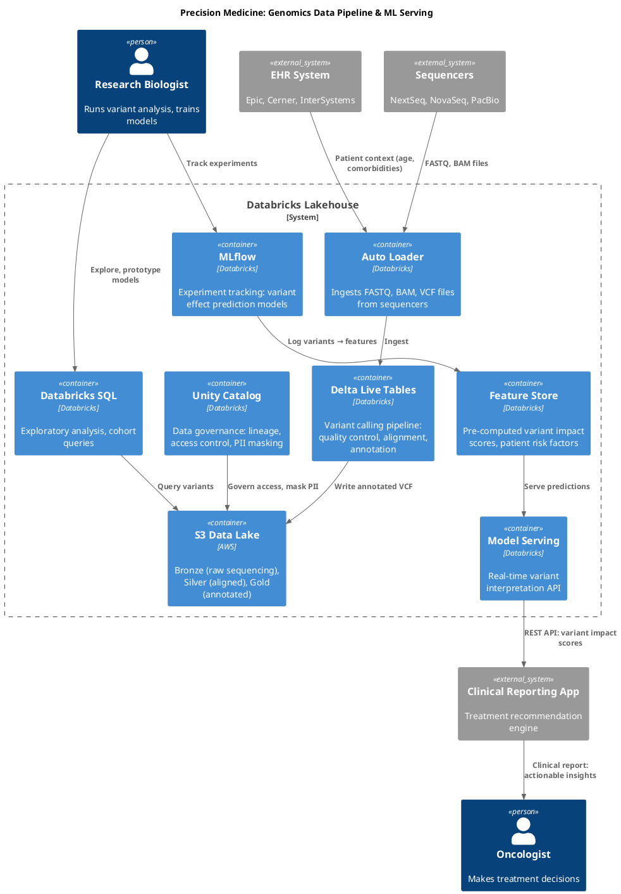

**Talking Points:**
- End-to-end reproducibility (MLflow + DLT for audit trail)
- Real-time API for clinical decision support
- Feature store reduces model deployment latency
- Governance layer protects patient data at every step

---

### Scenario 3: Unity Catalog Migration (legacy data lake → governed lakehouse)

**Audience:** Enterprise architects, data governance team  
**Intent:** Show before/after, governance gains, compliance alignment  
**Recommended Format:** D2 with side-by-side comparison

```d2
direction: right

before: Before (Legacy Data Lake) {
  style.fill: "#FFE6E6"
  s3: AWS S3 {
    folder_hell: /data/raw/...
    folder_mess: /data/processed/...
    folder_chaos: /data/ml_models/...
  }
  problems: Problems {
    orphaned: Orphaned datasets
    lineage_none: No lineage tracking
    access_wild: Ad-hoc access (S3 bucket policies)
    compliance_gap: Compliance gaps
  }
}

after: After (Databricks Lakehouse + UC) {
  style.fill: "#E6FFE6"
  uc: Unity Catalog {
    metastore: Metastore
    prod_catalog: Catalog: prod
    dev_catalog: Catalog: dev
  }
  schemas: Schemas (organized) {
    raw: Schema: raw_fhir
    cleaned: Schema: cleaned
    features: Schema: ml_features
  }
  benefits: Benefits {
    lineage: Full lineage tracking
    access: Fine-grained role-based access
    audit: Audit logs, column-level masking
    compliance: HIPAA, GDPR ready
  }
}

migration: Migration Path {
  assess: 1. Assess (data inventory, ownership)
  design: 2. Design (catalog/schema hierarchy)
  migrate: 3. Migrate (external → UC tables)
  validate: 4. Validate (lineage, access)
}

before.s3 -> migration.assess: Identify stale / duplicate datasets
migration.assess -> migration.design: Map to UC hierarchy
migration.design -> migration.migrate: Create UC tables via DLT
migration.migrate -> after.uc: Golden-path ingestion
migration.migrate -> after.schemas: Organize by domain
after.benefits -> compliance: Audit-ready governance
```

**Talking Points:**
- Phased migration (no big-bang cut-over)
- Lineage + audit trails for compliance officers
- Data quality expectations in DLT
- Reduced shadow IT (self-service governance)

---

### Scenario 4: Manufacturing Quality Control (IoT → Real-Time Analytics)

**Audience:** Operations + quality teams  
**Intent:** Show real-time defect detection, batch traceability  
**Recommended Format:** Mermaid (GitHub-friendly, simpler for ops teams)

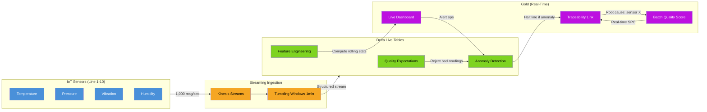

**Talking Points:**
- Real-time defect detection (minutes, not hours)
- Full batch traceability for recalls
- Structured streaming for high-frequency data
- Anomaly detection reduces scrap/rework

---

### Scenario 5: Compliance Audit Trail (Data Lineage for Regulators)

**Audience:** Compliance officers, internal audit, external regulators  
**Intent:** Show how Unity Catalog + DLT provide audit-ready lineage  
**Recommended Format:** PlantUML C4 Context (executive-friendly)

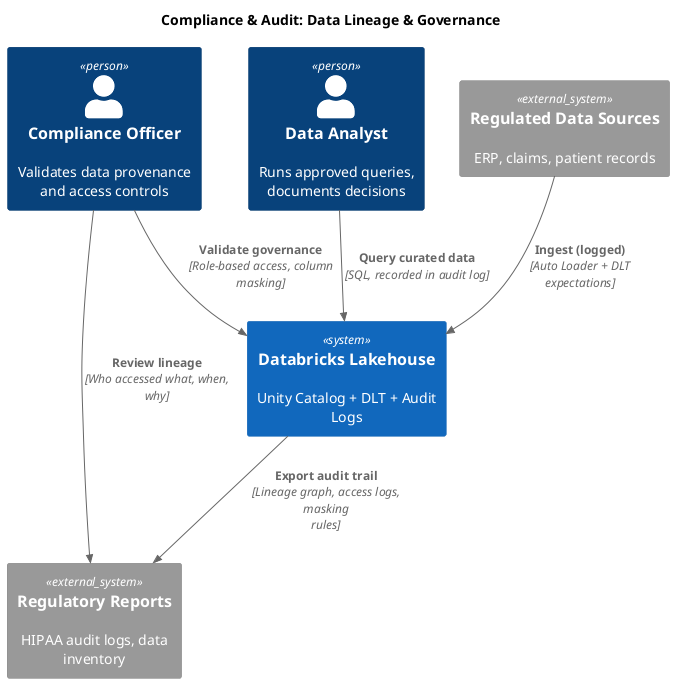

**Talking Points:**
- Every data transformation logged (source → bronze → silver → gold)
- Column-level masking for PII (automatic redaction for analysts)
- Access control tied to job role, not individuals
- Audit logs exportable for regulators (SOX, HIPAA, GDPR)

---

## Architecture Patterns Library

Reference patterns for common solutions architect work. Use these as starting templates — adapt to the user's specific context.

### Medallion Architecture (Databricks)

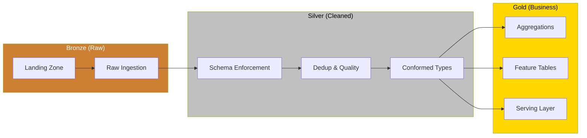

### Unity Catalog Hierarchy

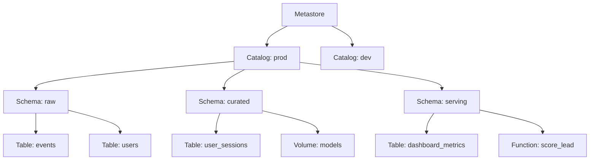

### Data Pipeline (DLT / Spark Streaming)

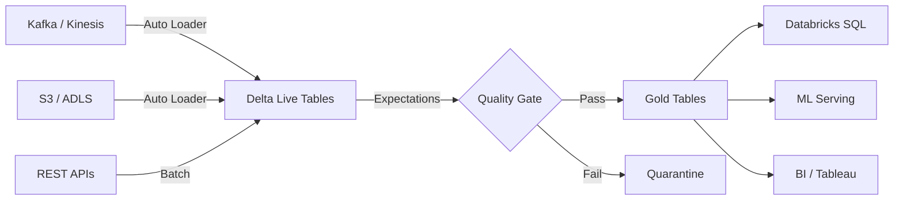

### AWS Data Platform

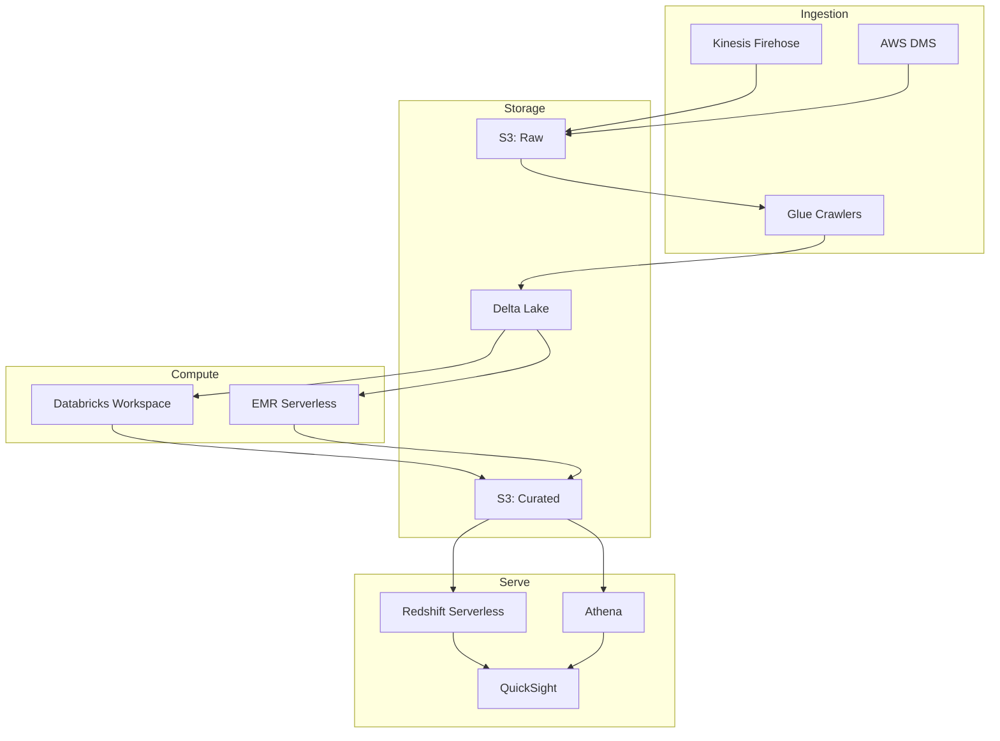

### Sequence: API Request Flow

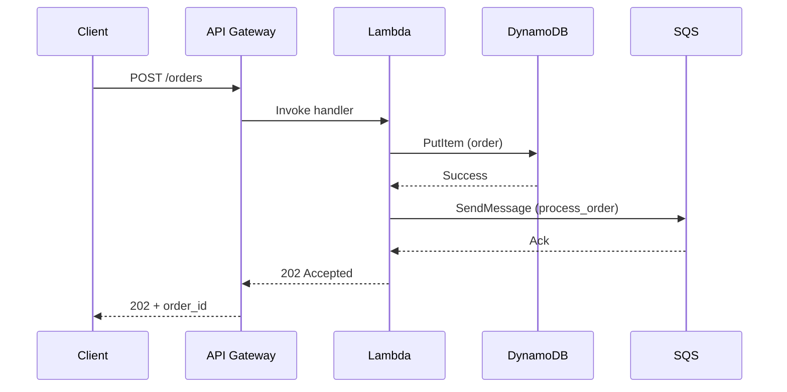

### State Diagram: Job Lifecycle

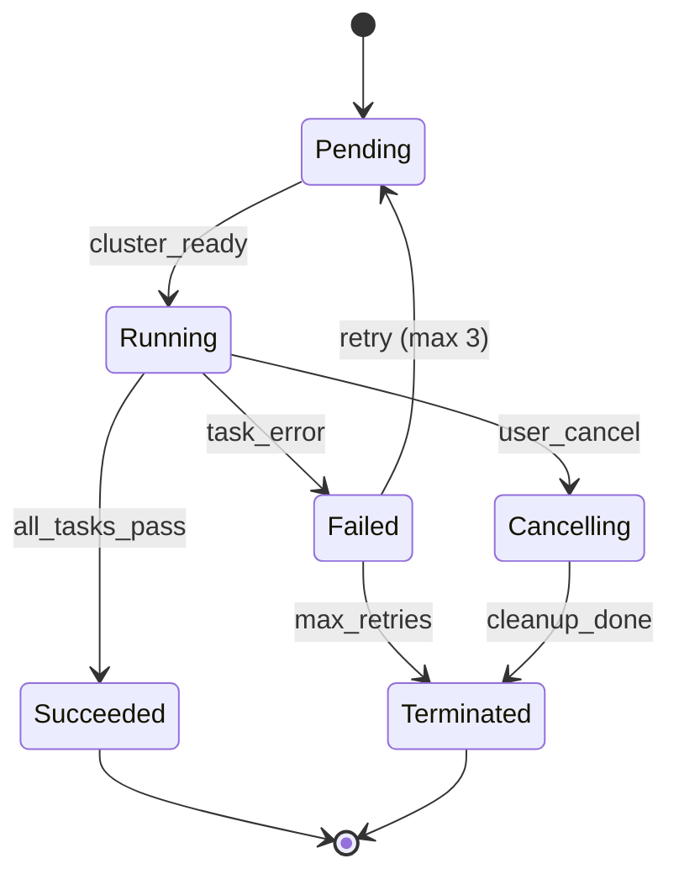

### C4 Context: Data Platform (PlantUML)

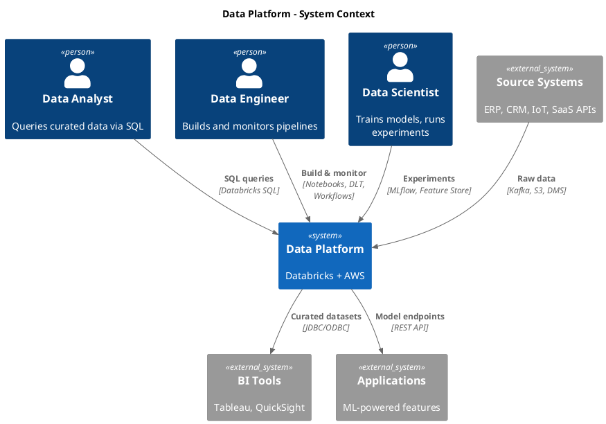

### C4 Container: Data Platform (PlantUML)

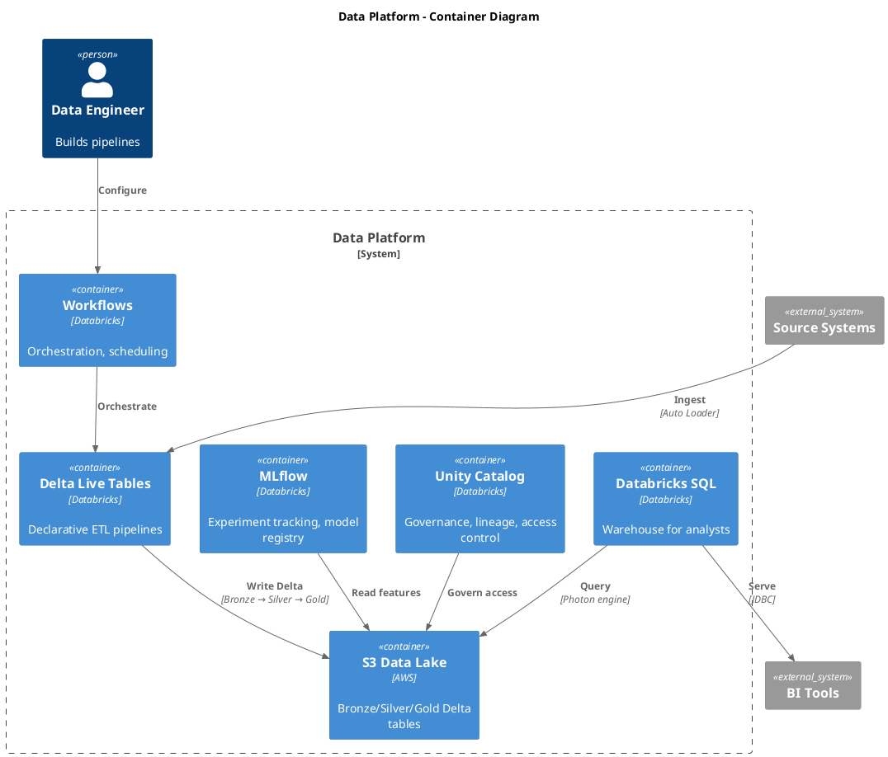

### D2: Lakehouse Architecture

```d2
direction: right

sources: Source Systems {
  erp: ERP
  crm: CRM
  iot: IoT Streams
  saas: SaaS APIs
}

ingestion: Ingestion Layer {
  autoloader: Auto Loader
  kafka: Kafka Connect
  dms: AWS DMS
}

lakehouse: Databricks Lakehouse {
  bronze: Bronze {
    style.fill: "#CD7F32"
    raw_events: Raw Events
    raw_users: Raw Users
  }
  silver: Silver {
    style.fill: "#C0C0C0"
    clean_events: Clean Events
    user_profiles: User Profiles
  }
  gold: Gold {
    style.fill: "#FFD700"
    daily_metrics: Daily Metrics
    feature_store: Feature Store
    serving_tables: Serving Tables
  }

  unity_catalog: Unity Catalog {
    style.fill: "#4A90D9"
    style.font-color: "#fff"
  }
}

consumers: Consumers {
  sql_warehouse: Databricks SQL
  ml_serving: ML Serving
  tableau: Tableau
  quicksight: QuickSight
}

sources.erp -> ingestion.dms: CDC
sources.crm -> ingestion.autoloader: Files
sources.iot -> ingestion.kafka: Streaming
sources.saas -> ingestion.autoloader: API dumps

ingestion.autoloader -> lakehouse.bronze
ingestion.kafka -> lakehouse.bronze
ingestion.dms -> lakehouse.bronze

lakehouse.bronze -> lakehouse.silver: DLT expectations
lakehouse.silver -> lakehouse.gold: Aggregations
lakehouse.unity_catalog -> lakehouse.bronze: Govern
lakehouse.unity_catalog -> lakehouse.silver: Govern
lakehouse.unity_catalog -> lakehouse.gold: Govern

lakehouse.gold.serving_tables -> consumers.sql_warehouse
lakehouse.gold.feature_store -> consumers.ml_serving
consumers.sql_warehouse -> consumers.tableau: JDBC
consumers.sql_warehouse -> consumers.quicksight: JDBC
```

---

## D2 Styling Reference

### Colors & Semantics

```d2
# Medallion layers
bronze: { style.fill: "#CD7F32" }      # Bronze
silver: { style.fill: "#C0C0C0" }      # Silver
gold: { style.fill: "#FFD700" }        # Gold

# Cloud / compute
aws_compute: { style.fill: "#FF9900" }
databricks: { style.fill: "#4A90D9" }
gcp: { style.fill: "#EA4335" }

# Data flow
storage: { style.fill: "#34A853" }
ingestion: { style.fill: "#F5A623" }
serving: { style.fill: "#BD10E0" }

# Status
success: { style.fill: "#7ED321" }
warning: { style.fill: "#F5A623" }
error: { style.fill: "#D0021B" }
```

### Typography & Spacing

```d2
# Large labels for subgraphs
subgraph_name: { style.font-size: 16; style.font-weight: bold }

# Icon hints
icon: { style.icon: "https://..." }

# Connection labels (auto-positioned)
A -> B: "Label here (auto-positioned)"

# Multi-line labels
A -> B: "Line 1\nLine 2"
```

### Sketch Mode (Presentation-Ready)

```d2
direction: right
sketch: true              # Hand-drawn aesthetic

system: { style.fill: "#E8F4F8" }
```

---

## Diagram Type Selection Guide

| User asks about... | Diagram type | Mermaid syntax |
|---|---|---|
| How data flows through the system | `flowchart LR` | Left-to-right flow |
| How components interact over time | `sequenceDiagram` | Message arrows between participants |
| What states a process goes through | `stateDiagram-v2` | State transitions |
| How systems relate at a high level | `C4Context` | People, systems, relationships |
| What's inside a system | `C4Container` | Containers within a system boundary |
| What's inside a container | `C4Component` | Components within a container |
| Database schema / relationships | `erDiagram` | Entity-relationship |
| Deployment / infrastructure | `flowchart TD` | Top-down with subgraphs |
| Sprint planning / timeline | `gantt` | Timeline bars |
| Decision logic | `flowchart TD` with diamonds | Decision nodes |

---

## Output Conventions

```
Mermaid files:  docs/diagrams/{name}.mmd       (source)
                docs/diagrams/{name}.svg       (rendered)
Excalidraw:     docs/diagrams/{name}.excalidraw (source)
                docs/diagrams/{name}.png       (exported)
D2:             docs/diagrams/{name}.d2        (source)
                docs/diagrams/{name}.svg       (rendered)
PlantUML:       docs/diagrams/{name}.puml      (source)
                docs/diagrams/{name}.svg       (rendered)
```

Embed in markdown:
````markdown


````

---

## Style Guide

- **Labels over arrows** — every arrow should say what flows through it
- **Subgraphs for boundaries** — group by team, environment, or data zone
- **Color semantics** — Bronze/Silver/Gold for medallion; blue for compute, green for storage, orange for ingestion
- **Keep it readable** — max 15-20 nodes per diagram. Split into multiple diagrams if larger.
- **Title every diagram** — use Mermaid's `---\ntitle: ...\n---` frontmatter or a markdown heading above
- **D2 sketch mode for presentations** — `sketch: true` gives hand-drawn aesthetic without Excalidraw

### When NOT to Diagram

**Skip the diagram if:**
- The system is trivial (single service, no external dependencies) — prose is clearer
- The audience is deep in the code already — whiteboard or live conversation is better
- The system is highly stable and rarely changes — cost of maintenance > benefit
- You're using the diagram as a crutch instead of explaining the actual design — fix the design conversation, not the diagram

A diagram that is stale is worse than no diagram. If you can't maintain it, don't create it.

### Accessibility

- **Color-blind safe palette** — never use red/green distinction alone. Use shape + color + label to differentiate.
- **Alt text** — every embedded diagram needs descriptive alt text: `` not ``
- **Contrast** — ensure text is readable against fill colors. Dark text on light fills, light text on dark fills.
- **Labeled arrows** — don't rely on color or position alone to convey meaning. Every connection should have a text label.

### Anti-Patterns (Diagram Smells)

- **Spaghetti flow** — if lines cross more than twice, restructure the layout or split into multiple diagrams
- **Box overload** — more than 15-20 nodes = unreadable. Decompose into C4 levels (Context → Container → Component)
- **Unlabeled arrows** — an arrow without a label is a guess. Always say what flows through it.
- **Symmetric layout lie** — don't make unequal things look equal. If one path handles 95% of traffic, make it visually dominant.
- **Stale diagram** — a diagram that doesn't match the code is worse than no diagram. Date every diagram and note the source of truth.

---

## Live Reload Workflow (Mermaid Server)

Use this when iterating on diagrams with a user in real-time:

```
1. Open mermaid server (localhost:3000 in new tab)
2. Paste diagram code into editor
3. Changes auto-render in real-time
4. User gives feedback → you edit code → instant preview
5. Once happy: export to SVG/PNG and save to docs/diagrams/
```

**When to use live reload:**
- Whiteboarding with stakeholders (real-time layout tweaks)
- First-pass iterations where you're unsure of layout
- Teaching someone how to read a diagram (step-by-step reveal)

**When to batch-render with uml-mcp:**
- Final production diagrams (better image quality)
- Complex layouts that need careful tuning
- Multiple diagrams at once

---

*"A diagram is a conversation compressed into a picture. If it needs a paragraph to explain, it needs another iteration."*

---

**Changelog & Cross-References:**

- v2.1 (current): Added Databricks GTM use cases (oncology, genomics, UC migration, manufacturing, compliance), audience-intent workflow, D2 styling guide, when-NOT-to-diagram, live reload workflow
- v2.0: Initial skill with uml-mcp, patterns library, C4 examples
- See also: **interactive-diagrams** skill for clickable, zoomable, real-time updating diagrams
