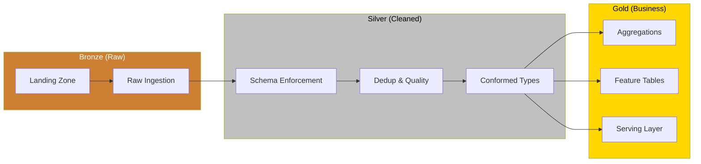
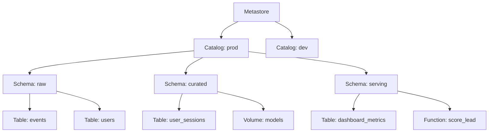
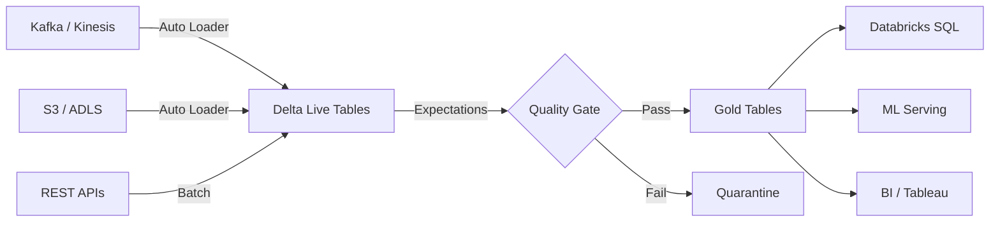
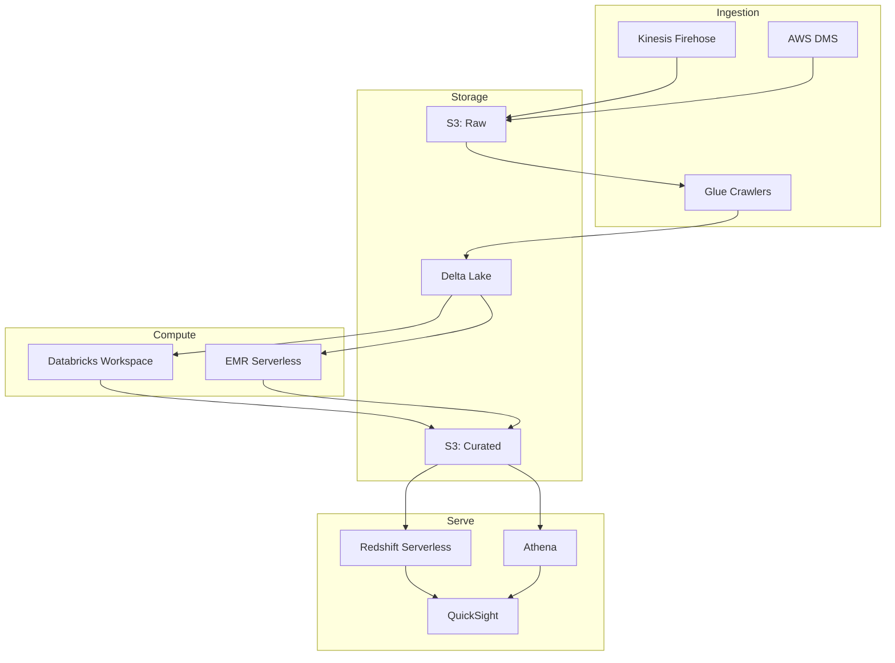
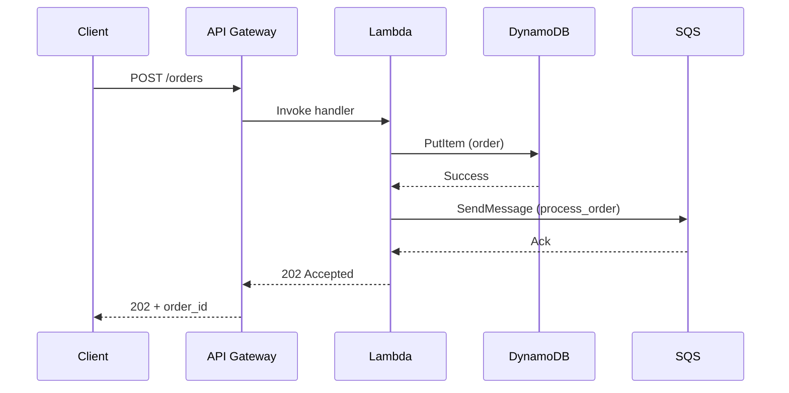
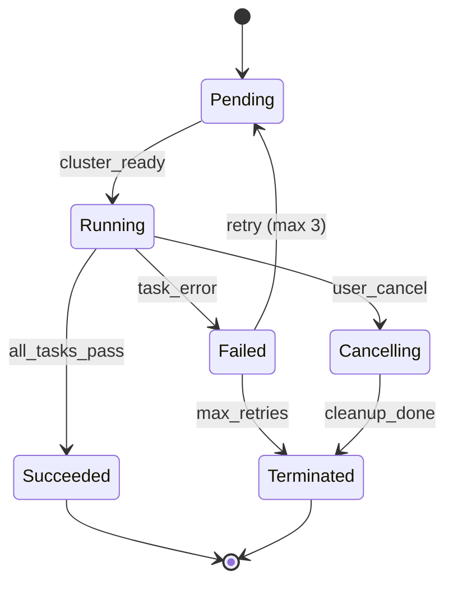
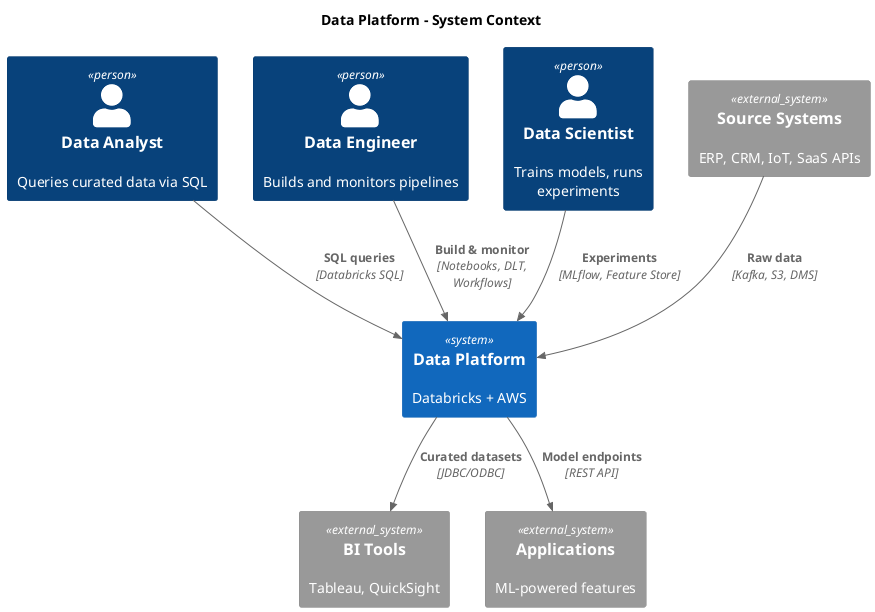
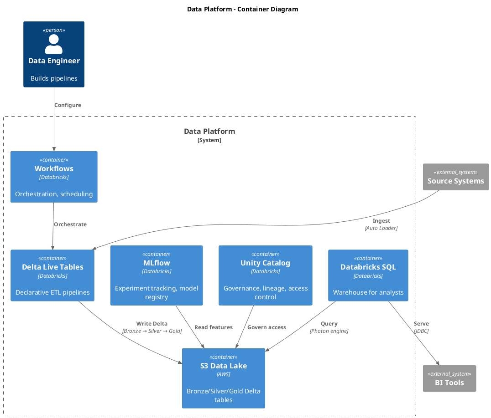

# Diagram

Generate technical architecture diagrams using multiple formats. Built for solutions architects working with Databricks, AWS, and data platforms.

## Tool Selection

```
C4 architecture (Context/Container/Component)?  → uml-mcp (PlantUML C4)
Clean, modern layout with good theming?          → uml-mcp (D2)
Needs to render in GitHub markdown?              → uml-mcp (Mermaid) or mermaid server (live reload)
Graph/network topology?                          → uml-mcp (Graphviz)
Entity-relationship / data model?                → uml-mcp (ERD)
Business process / workflow?                     → uml-mcp (BPMN)
Presentation-ready, hand-drawn aesthetic?         → Excalidraw
Quick preview with live reload?                  → mermaid server (fallback)
```

**Default to uml-mcp** — it covers the most formats via Kroki. Use the dedicated `mermaid` server only when you need live browser reload during iteration.

## MCP Tools Available

**uml-mcp** (`uml-mcp` server — primary, covers 16 diagram types):
- `generate_uml` — render diagram to file (SVG/PNG/PDF)
  - `diagram_type`: class, sequence, activity, usecase, state, component, deployment, object, mermaid, d2, graphviz, tikz, erd, blockdiag, bpmn, c4
  - `code`: diagram source code in the chosen format
  - `output_format`: svg (default), png, pdf
  - `output_dir`: where to save (optional)
  - `theme`, `scale`: styling options
- `generate_diagram_url` — returns URL + base64 (no file saved)

**Mermaid** (`mermaid` server — fallback, live reload):
- `mermaid_preview` — render + live preview in browser
- `mermaid_save` — export to SVG/PNG/PDF

**Excalidraw** (`excalidraw` server — requires canvas on localhost:3000):
- `create_element`, `batch_create_elements` — draw shapes, arrows, text
- `export_to_image`, `export_scene` — export to PNG/SVG/JSON
- `create_from_mermaid` — convert Mermaid to Excalidraw
- `describe_scene`, `get_canvas_screenshot` — visual feedback loop

## Format Selection Guide

| Use case | Best format | Why |
|---|---|---|
| System context / containers / components | **PlantUML C4** | Purpose-built for C4 model, best tooling |
| Complex architecture with clean layout | **D2** | Multiple layout engines, sketch mode, modern |
| GitHub PR / README embedding | **Mermaid** | Native GitHub rendering |
| Network/infra topology | **Graphviz** | Best automatic layout for graphs |
| Database schema | **ERD** | Purpose-built for entity relationships |
| Business process flows | **BPMN** | Industry standard |
| Quick iteration with live preview | **Mermaid** (via mermaid server) | Live browser reload |
| Customer-facing slides | **Excalidraw** | Hand-drawn aesthetic |

## Workflow

```
1. Clarify what diagram the user needs (type, audience, output format)
2. Choose format and tool (see selection guide above)
3. Generate diagram via uml-mcp (or mermaid server for live preview)
4. Preview — show to user or open in browser
5. Iterate — refine based on feedback
6. Save — export to the requested format and path
```

**Always preview before saving.** Never save a diagram the user hasn't seen.

---

## Architecture Patterns Library

Reference patterns for common solutions architect work. Use these as starting templates — adapt to the user's specific context.

### Medallion Architecture (Databricks)



### Unity Catalog Hierarchy



### Data Pipeline (DLT / Spark Streaming)



### AWS Data Platform



### Sequence: API Request Flow



### State Diagram: Job Lifecycle



### C4 Context: Data Platform (PlantUML — use with `diagram_type: c4`)



### C4 Container: Data Platform (PlantUML — use with `diagram_type: c4`)



### D2: Lakehouse Architecture (use with `diagram_type: d2`)

```d2
direction: right

sources: Source Systems {
  erp: ERP
  crm: CRM
  iot: IoT Streams
  saas: SaaS APIs
}

ingestion: Ingestion Layer {
  autoloader: Auto Loader
  kafka: Kafka Connect
  dms: AWS DMS
}

lakehouse: Databricks Lakehouse {
  bronze: Bronze {
    style.fill: "#CD7F32"
    raw_events: Raw Events
    raw_users: Raw Users
  }
  silver: Silver {
    style.fill: "#C0C0C0"
    clean_events: Clean Events
    user_profiles: User Profiles
  }
  gold: Gold {
    style.fill: "#FFD700"
    daily_metrics: Daily Metrics
    feature_store: Feature Store
    serving_tables: Serving Tables
  }

  unity_catalog: Unity Catalog {
    style.fill: "#4A90D9"
    style.font-color: "#fff"
  }
}

consumers: Consumers {
  sql_warehouse: Databricks SQL
  ml_serving: ML Serving
  tableau: Tableau
  quicksight: QuickSight
}

sources.erp -> ingestion.dms: CDC
sources.crm -> ingestion.autoloader: Files
sources.iot -> ingestion.kafka: Streaming
sources.saas -> ingestion.autoloader: API dumps

ingestion.autoloader -> lakehouse.bronze
ingestion.kafka -> lakehouse.bronze
ingestion.dms -> lakehouse.bronze

lakehouse.bronze -> lakehouse.silver: DLT expectations
lakehouse.silver -> lakehouse.gold: Aggregations
lakehouse.unity_catalog -> lakehouse.bronze: Govern
lakehouse.unity_catalog -> lakehouse.silver: Govern
lakehouse.unity_catalog -> lakehouse.gold: Govern

lakehouse.gold.serving_tables -> consumers.sql_warehouse
lakehouse.gold.feature_store -> consumers.ml_serving
consumers.sql_warehouse -> consumers.tableau: JDBC
consumers.sql_warehouse -> consumers.quicksight: JDBC
```

---

## Diagram Type Selection Guide

| User asks about... | Diagram type | Mermaid syntax |
|---|---|---|
| How data flows through the system | `flowchart LR` | Left-to-right flow |
| How components interact over time | `sequenceDiagram` | Message arrows between participants |
| What states a process goes through | `stateDiagram-v2` | State transitions |
| How systems relate at a high level | `C4Context` | People, systems, relationships |
| What's inside a system | `C4Container` | Containers within a system boundary |
| What's inside a container | `C4Component` | Components within a container |
| Database schema / relationships | `erDiagram` | Entity-relationship |
| Deployment / infrastructure | `flowchart TD` | Top-down with subgraphs |
| Sprint planning / timeline | `gantt` | Timeline bars |
| Decision logic | `flowchart TD` with diamonds | Decision nodes |

---

## Output Conventions

```
Mermaid files:  docs/diagrams/{name}.mmd       (source)
                docs/diagrams/{name}.svg       (rendered)
Excalidraw:     docs/diagrams/{name}.excalidraw (source)
                docs/diagrams/{name}.png       (exported)
```

Embed in markdown:
````markdown

````

---

## Style Guide

- **Labels over arrows** — every arrow should say what flows through it
- **Subgraphs for boundaries** — group by team, environment, or data zone
- **Color semantics** — Bronze/Silver/Gold for medallion; blue for compute, green for storage, orange for ingestion
- **Keep it readable** — max 15-20 nodes per diagram. Split into multiple diagrams if larger.
- **Title every diagram** — use Mermaid's `---\ntitle: ...\n---` frontmatter or a markdown heading above

### Accessibility

- **Color-blind safe palette** — never use red/green distinction alone. Use shape + color + label to differentiate.
- **Alt text** — every embedded diagram needs descriptive alt text: `` not ``
- **Contrast** — ensure text is readable against fill colors. Dark text on light fills, light text on dark fills.
- **Labeled arrows** — don't rely on color or position alone to convey meaning. Every connection should have a text label.

### Anti-Patterns (Diagram Smells)

- **Spaghetti flow** — if lines cross more than twice, restructure the layout or split into multiple diagrams
- **Box overload** — more than 15-20 nodes = unreadable. Decompose into C4 levels (Context → Container → Component)
- **Unlabeled arrows** — an arrow without a label is a guess. Always say what flows through it.
- **Symmetric layout lie** — don't make unequal things look equal. If one path handles 95% of traffic, make it visually dominant.
- **Stale diagram** — a diagram that doesn't match the code is worse than no diagram. Date every diagram and note the source of truth.

---

*"A diagram is a conversation compressed into a picture. If it needs a paragraph to explain, it needs another iteration."*
